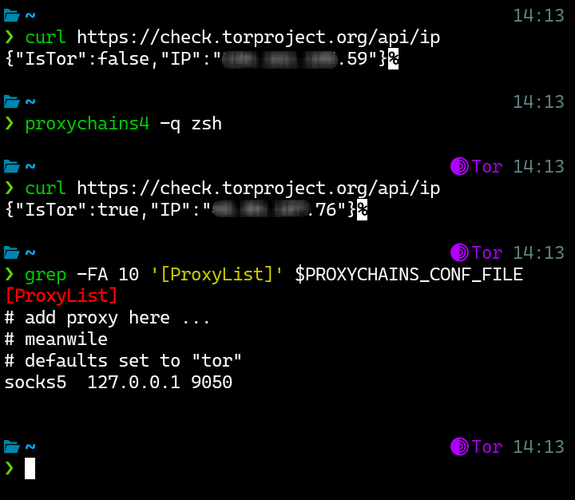
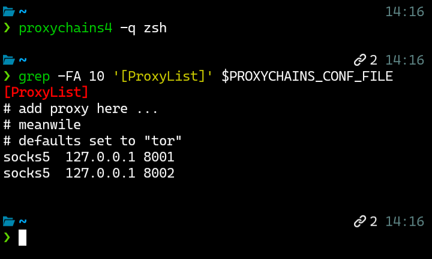

# Module library for .p10k.zsh.d

This branch hosts modules for custom prompt segments to be used with **.p10k.zsh.d**. See the [main branch](https://github.com/emamoah/.p10k.zsh.d/tree/main) for details.

Each module is contained in a `.zsh` file. You can copy any of those to your `~/.p10k.zsh.d` directory and add them to your prompt with the `p10k_d_*` commands, as documented in the [main README](https://github.com/emamoah/.p10k.zsh.d/blob/main/README.md#usage). The "Quick install" sections under each module below provide a quick way to download the module file to your `~/.p10k.zsh.d` directory with one command.

All modules added to the library will be documented below. Pull requests are welcome for new modules.

Each documented module defines some metadata, namely:

<dl>
  <dt>Author</dt>
  <dd>Author of the module file</dd>

  <dt>File</dt>
  <dd>Filename of the module</dd>

  <dt>Segment</dt>
  <dd>Prompt segment identifier, used in the <code>p10k_d_*</code> commands</dd>
</dl>

## Modules

### Proxychains

<dl>
  <dt>Author</dt>
  <dd>Emmanuel Amoah</dd>

  <dt>File</dt>
  <dd>proxychains.zsh</dd>

  <dt><term>Segment</term></dt>
  <dd>proxychains</dd>
</dl>

<details>
<summary>Details</summary>

This module is based on the [proxychains-ng](https://github.com/rofl0r/proxychains-ng) project. It adds a prompt segment when proxychains is active for the zsh session, showing the number of active proxies. It does this by checking for the presence of the `PROXYCHAINS_CONF_FILE` environment variable and reads the file.

It shows a special indicator for Tor when it sees a SOCKS proxy on the loopback address on port 9050.

Here are screenshots of shell sessions with the module enabled:

 

The segment therefore has two states: _TOR_ and _NOTOR_ (representing when Tor is identified and when it is absent, respectively). Using those states, you can define `POWERLEVEL9K_*` parameters to override the default appearance of the segment. For example:

```shell
typeset -g POWERLEVEL9K_PROXYCHAINS_TOR_VISUAL_IDENTIFIER_EXPANSION='󰗹'
typeset -g POWERLEVEL9K_PROXYCHAINS_NOTOR_FOREGROUND='green'
```

</details>

#### Quick install

```shell
curl -sSLO --output-dir ~/.p10k.zsh.d https://github.com/emamoah/.p10k.zsh.d/raw/refs/heads/modules/proxychains.zsh
```
